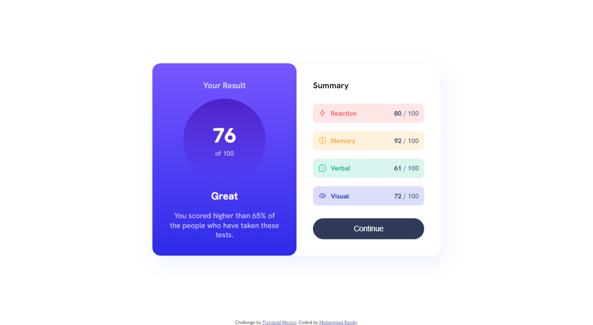
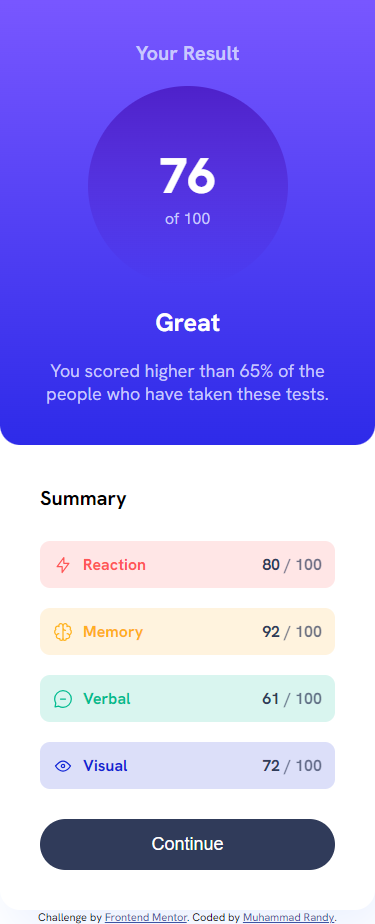
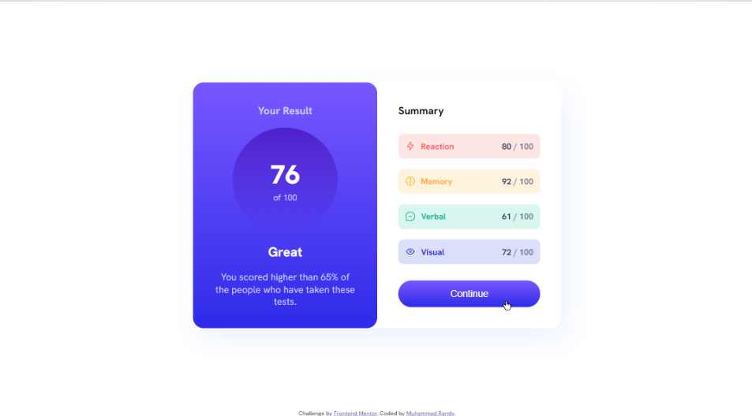

# Frontend Mentor - Results summary component solution

This is a solution to the [Results summary component challenge on Frontend Mentor](https://www.frontendmentor.io/challenges/results-summary-component-CE_K6s0maV). Frontend Mentor challenges help you improve your coding skills by building realistic projects.

## Table of contents

- [Overview](#overview)
  - [The challenge](#the-challenge)
  - [Screenshot](#screenshot)
  - [Links](#links)
- [My process](#my-process)
  - [Built with](#built-with)
  - [What I learned](#what-i-learned)
  - [Useful resources](#useful-resources)
- [Author](#author)

## Overview

### The challenge

Users should be able to:

- View the optimal layout for the interface depending on their device's screen size
- See hover and focus states for all interactive elements on the page
- **Bonus**: Use the local JSON data to dynamically populate the content

### Screenshot

#### Dekstop Preview

#### Mobile Preview

#### Hover Preview

### Links

- Solution URL: [Github](https://github.com/MuhRandy/faq-accordion-main-frontendmentor)
- Live Site URL: [Github Pages](https://muhrandy.github.io/faq-accordion-main-frontendmentor/)

## My process

### Built with

- Semantic HTML5 markup
- CSS custom properties
- Flexbox
- Responsive

### What I learned

- CSS Gradient
- CSS Whitespace
- Fetch JSON data

### Useful resources

- [W3School](https://www.w3schools.com/) - This helped me for almost anything, just like the documentation of HTML, CSS, and javascript.
- [Stack Overflow](https://stackoverflow.com/) - This is an amazing forum where you can ask or find someone with similiar problem you have that already solved.

## Author

- Website - [Muhammad Randy](https://mrandy-portfolio.web.app/)
- Frontend Mentor - [@MuhRandy](https://www.frontendmentor.io/profile/MuhRandy)
- Twitter - [@RandyThz](https://twitter.com/RandyThz)
